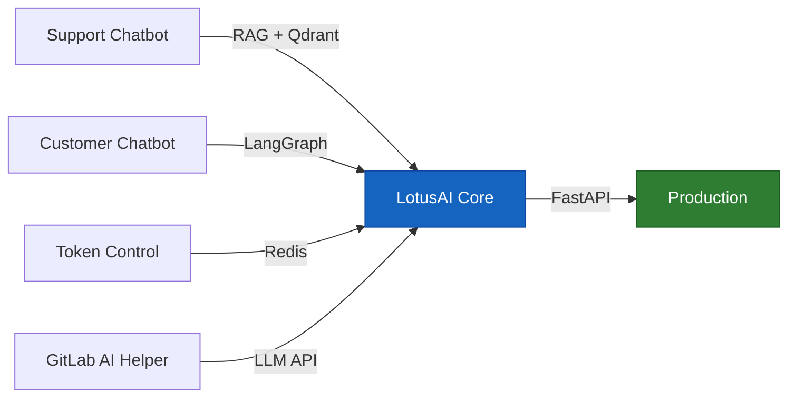
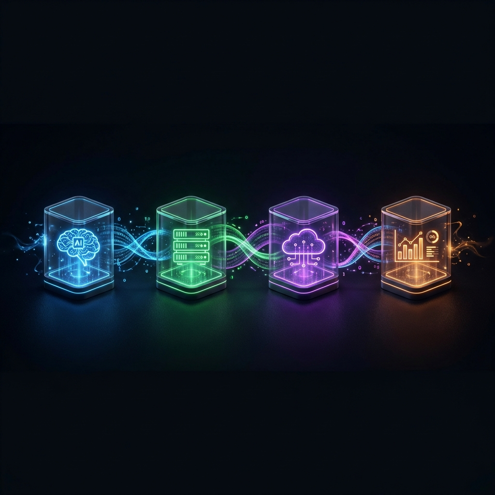
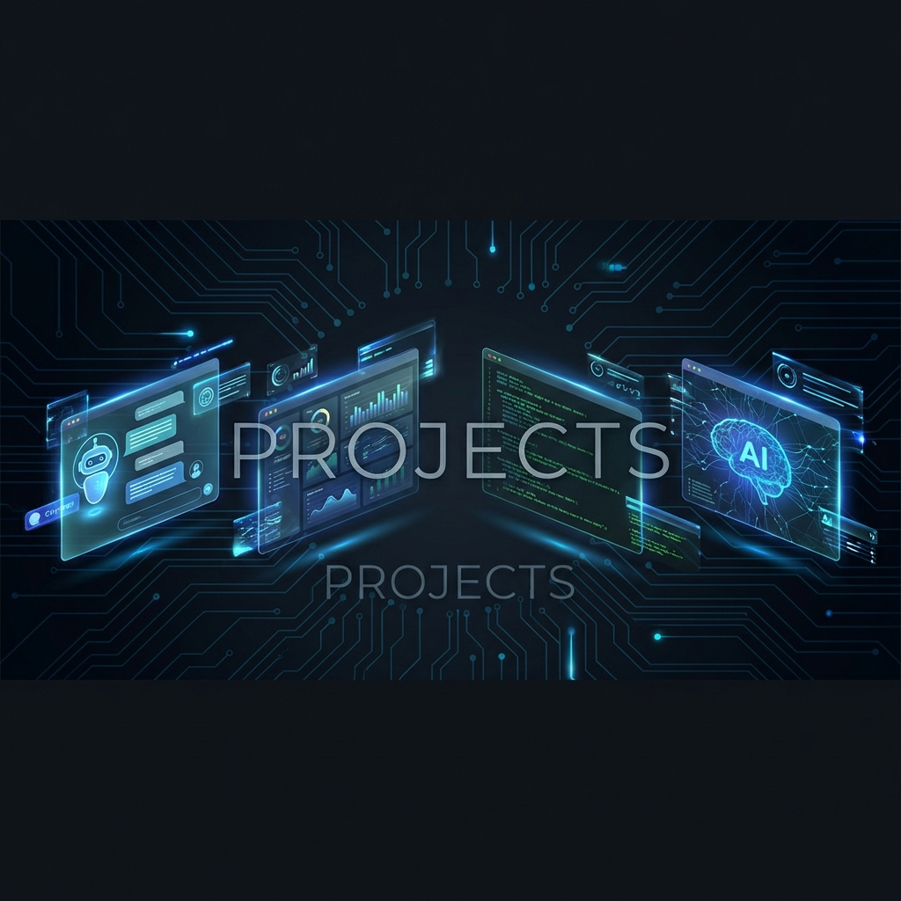
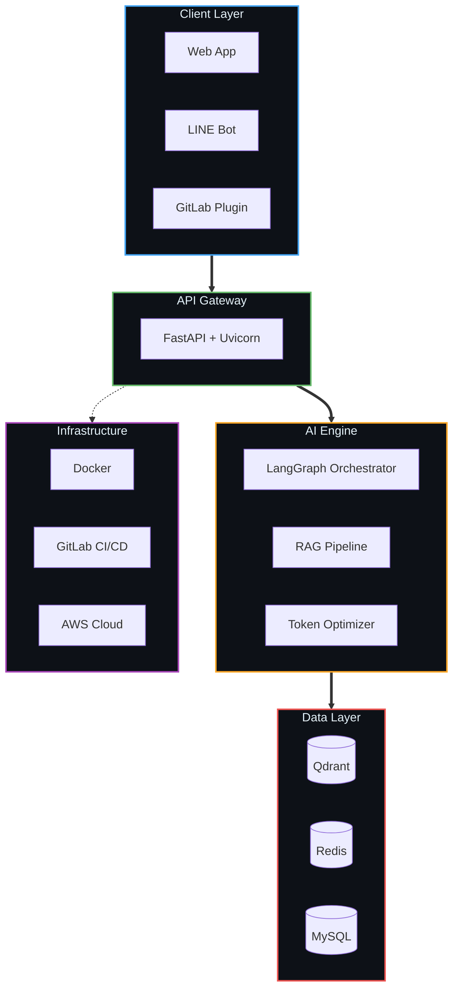

<!-- ═══════════════════════════════════════════════════════════════════════ -->
<!-- SURAKIAT KONGCHANA — AI ENGINEER | GITHUB PROFILE README             -->
<!-- ═══════════════════════════════════════════════════════════════════════ -->

<!-- WAVE OVERLAY -->

<!-- TYPING ANIMATION -->

<!-- CONTACT BADGES -->

  &nbsp;
  &nbsp;
  &nbsp;
  

<!-- QUICK STATUS BAR -->

  
  
  
  

<!-- DIVIDER -->

##  &nbsp;About Me

> **Surakiat Kongchana** (BBEER) — AI Engineer based in Thailand 🇹🇭

- 🧠 **Role:** AI Engineer | LLM Architect | Backend Developer
- 🎓 **Education:** B.Sc. Data Science — Naresuan University
- 🏗️ **Built LotusAI** — 4-stage AI ecosystem @ CP AXTRA
- 📉 **Impact:** 60% token cut · 70% cost savings · CSAT 4.4/5
- ⚡ **Resolution:** 10 min → 1 min support ticket time
- 🏆 **Awards:** Super AI Engineer S5 · Hackathon Finalist

 

<!-- DIVIDER -->

## ⚡ &nbsp;Current Dev Focus

🔭 **Working On:**
- AI-powered chatbots with RAG & LangGraph
- Production LLM systems with token optimization
- Synthetic data generation pipelines

🌱 **Learning:**
- Advanced AI Agent architectures (multi-agent systems)
- MLOps & model deployment at scale
- Cloud-native AI services on AWS

🛠️ **Daily Tools:**
- **Editor:** VS Code + GitHub Copilot
- **AI Stack:** LangChain · Ollama · Qdrant
- **Backend:** FastAPI · Redis · Docker
- **DevOps:** Git · GitLab CI/CD

💬 **Ask me about:**
- Building RAG pipelines from scratch
- LLM cost optimization strategies
- FastAPI best practices
- Synthetic data generation

<!-- DIVIDER -->

##  &nbsp;Career Timeline

<b>🏢 CP AXTRA Public Company Limited — AI Engineer Intern &nbsp;|&nbsp; Jul 2025 – Nov 2025 &nbsp;|&nbsp; Bangkok</b>

 

> 🏢 *CP AXTRA — Parent of Lotus's & Makro, Thailand's largest wholesale-retail conglomerate*

**Built LotusAI — a 4-Stage AI Ecosystem** serving multiple departments with unified LLM infrastructure:

| 🚀 Deliverable | 🔧 Tech Stack | 📊 Impact |
|:--|:--|:--|
| **Support Chatbot** | RAG, Qdrant, LangGraph, FastAPI | Resolution: **10 min → 1-2 min** |
| **Customer Chatbot** | LangChain, Redis, WebSocket | Customer CSAT: **4.4/5** ⭐ |
| **Token Control System** | Custom Middleware, Redis Cache | **60%** token reduction, **70%** cost saved |
| **GitLab AI Helper** | GitLab API, LLM Integration | Error rate: **under 1%** |

<b>🧠 Artificial Intelligence Association of Thailand — AI Engineer &nbsp;|&nbsp; Dec 2024 – Nov 2025 &nbsp;|&nbsp; Pathum Thani</b>

 

> 🧠 *Super AI Engineer Program — Session 5, Level 1*

- 🏗️ Prototyped & deployed **end-to-end AI services**: FastAPI inference endpoints + LLM integration
- 🧬 Generated synthetic datasets using **REaLTabFormer** & **SDV** frameworks
- 🏆 Completed **5 domain-specific hackathons** + **24-hour Grand Finale**
- 🎤 **Finalist** in Demo Day AI ChatBot competition
- 📚 Curriculum: System Architecture · Data Pipelines · NLP · Computer Vision · IoT · Signal Processing

<b>🌏 Enov8 — Back-End Developer &nbsp;|&nbsp; Feb 2024 – Apr 2025 &nbsp;|&nbsp; Sydney, Australia (Remote)</b>

 

> 🌏 *International remote dev — building synthetic data infrastructure*

- 📄 Conducted R&D on **REaLTabFormer** papers for synthetic tabular data generation
- ⚙️ Built backend infrastructure with **Python & FastAPI** for international QA teams
- 🤖 Experimented with **LLM & Ollama** for intelligent synthetic data pipelines
- 🌐 Cross-timezone collaboration supporting model testing & validation workflows

<!-- DIVIDER -->

  

##  &nbsp;Tech Arsenal

### 🤖 AI / LLM Engineering

  
  
  
  
  
  
  
  

### ⚡ Backend & Database

  
  
  
  
  
  

### 📊 Data Science & ML

  
  
  
  
  
  

### ☁️ Cloud & DevOps

  
  
  
  
  
  
  

<!-- DIVIDER -->

  

##  &nbsp;Flagship Projects

### 🏗️ LotusAI Ecosystem — `@CP AXTRA`

> **4-Stage enterprise AI system** powering Thailand's largest retailer

- 🤝 **Support Chatbot** — RAG-powered support agent → Resolution **10 min → 1 min**
- 💬 **Customer Chatbot** — Real-time AI chat → CSAT **4.4/5** ⭐
- 🔐 **Token Control** — LLM cost optimization → **60% token reduction, 70% cost saved**
- 🔧 **GitLab AI Helper** — AI-assisted dev tools → Error rate **under 1%**
- **Stack:** `LangGraph` `Qdrant` `Redis` `FastAPI` `WebSocket`

---

### 💬 SCIExPro 2025 AI Chatbot

> **LINE chatbot** serving **1,000+ event attendees** with real-time info

- 🤖 Automated FAQs about competitions, schedules, awards
- 📍 Real-time venue navigation & event updates
- ⚡ Reduced staff workload through instant AI responses
- **Stack:** `LINE API` `LLM` `Python` `NLP`

---

### 🏆 depa GrowthLab: GenAI Hackathon (powered by AWS)

> **Finalist** in Demo Day round — GenAI ChatBot category

- 🧠 Built GenAI solutions during training program in Chiang Mai
- ☁️ AWS cloud architecture for AI workloads
- 🎤 Final pitch & live demo presentation
- **Stack:** `AWS` `LangChain` `GenAI`

---

### 🥇 Beyond Coding Competition

> **Award Winner** in Data Science & ML — Collaboration with Botnoi

- 📊 End-to-end data analysis & ML pipeline development
- 🧠 Model training, evaluation, and optimization
- 🤝 Cross-team collaboration with Botnoi
- **Stack:** `Scikit-learn` `Pandas` `PyTorch`

---

<!-- PINNED REPOS (GitHub links instead of broken stats cards) -->

  &nbsp;
  &nbsp;
  

<!-- DIVIDER -->

##  &nbsp;Systems I Architect

<!-- DIVIDER -->

##  &nbsp;GitHub Analytics

<!--
  💡 หาก GitHub Stats / Top Langs ไม่โหลด ให้ self-deploy:
  1. Fork https://github.com/anuraghazra/github-readme-stats
  2. Deploy ไปที่ Vercel ของคุณเอง
  3. เปลี่ยน URL ด้านล่างเป็น your-app-name.vercel.app
-->

<!-- STREAK STATS (demolab - reliable) -->

 

<!-- ACTIVITY GRAPH (separate project - reliable) -->

<!-- DIVIDER -->

## 🏆 &nbsp;Achievements

 

| 🏅 | Achievement | Details |
|:-:|:--|:--|
| 🏢 | **CP AXTRA AI Intern** | Architected LotusAI — production AI system at Thailand's largest retailer |
| 🧠 | **Super AI Engineer S5** | Completed 5 hackathons + 24-hour Grand Finale — AIAT certified |
| 🎤 | **Demo Day Finalist** | AI ChatBot category — AI Association of Thailand |
| 🥇 | **Beyond Coding Winner** | Award recipient in Data Science & ML — collab with Botnoi |
| 🌏 | **International Developer** | Remote backend developer with Enov8, Sydney, Australia |
| 👨‍💻 | **GitHub Dev Program** | GitHub Developer Program Member |

<!-- DIVIDER -->

## 🎓 &nbsp;Education

| | |
|:--|:--|
| 🏫 **University** | **Naresuan University** |
| 📘 **Degree** | B.Sc. Data Science and Analysis |
| 📍 **Location** | Phitsanulok, Thailand |
| 📅 **Period** | May 2023 — Present |
| 📚 **Focus Areas** | Machine Learning, Deep Learning, NLP, Computer Vision, Data Engineering |

<!-- DIVIDER -->

## 🐍 &nbsp;Contribution Snake

<!-- Snake animation will appear after pushing to GitHub and running the Action -->
<!-- Make sure to enable GitHub Actions in your Surakiatk/Surakiatk repo -->
<a href="https://github.com/Surakiatk">
  <picture>
    <source media="(prefers-color-scheme: dark)" srcset="https://raw.githubusercontent.com/Surakiatk/Surakiatk/output/github-contribution-grid-snake-dark.svg"/>
    <source media="(prefers-color-scheme: light)" srcset="https://raw.githubusercontent.com/Surakiatk/Surakiatk/output/github-contribution-grid-snake.svg"/>
    
  </picture>
</a>

> ⚠️ **หมายเหตุ:** Snake จะปรากฏหลังจาก push ไปยัง GitHub แล้วรัน Action ครั้งแรก — ไปที่ **Actions** tab → กด **Run workflow**

<!-- DIVIDER -->

##  &nbsp;Let's Connect & Build

&nbsp;
&nbsp;

  

---

 

